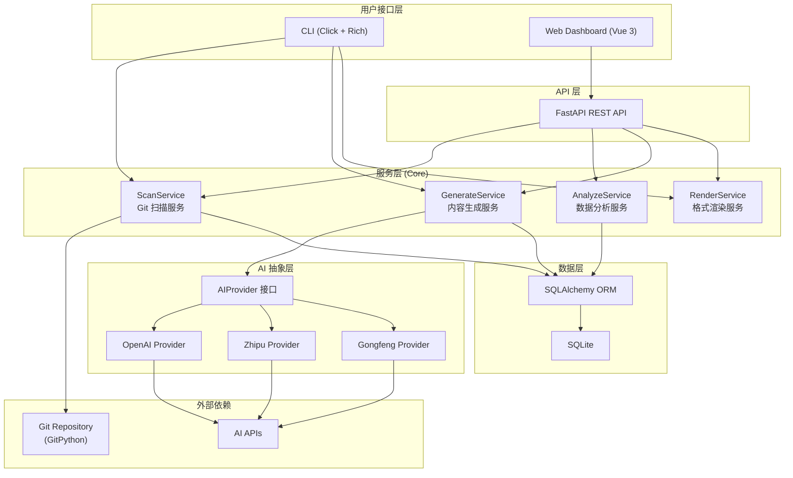

## 产品概述

DevDiary 是一个面向开发者的"第二大脑"工具，通过智能分析 Git 提交历史，借助 AI 自动生成开发日记、周报、月报，帮助开发者记录、理解和反思编程活动。当前阶段聚焦 MVP 核心功能。

## 核心功能

### 1. Git 智能扫描引擎

- 扫描本地 Git 仓库的 commit 历史，支持按日期范围筛选
- 解析代码 diff，提取文件变更统计（新增/修改/删除行数、文件列表）
- 自动识别项目使用的技术栈和框架（通过文件扩展名、配置文件、依赖声明等）
- 提取 commit message 中的关键信息（功能描述、bug 修复、重构等）

### 2. AI 内容生成服务

- 抽象 AI 接口层，支持多种后端切换（OpenAI、智谱 GLM、工蜂 AI 等），通过配置文件选择
- 将 Git 扫描结果整理为结构化 prompt，调用 AI 生成日记内容
- 支持三种文体风格：日记体（轻松记录）、技术博客体（深度分析）、周报体（简洁汇报）
- 智能摘要包含：今日工作内容、遇到的问题、学到的知识点

### 3. CLI 命令行工具

- `devdiary init` — 初始化项目配置（选择 AI 后端、设置仓库路径、生成配置文件）
- `devdiary today` — 扫描今日 commits 并生成日记
- `devdiary week` — 汇总本周 commits 生成周报
- `devdiary month` — 汇总本月 commits 生成月报
- 支持参数覆盖默认配置（如指定日期范围、输出格式、文体风格等）
- 终端输出美观，带颜色和进度提示，错误信息友好

### 4. 输出格式

- Markdown 文件输出，自动保存到指定目录
- HTML 网页输出，使用内置模板渲染，可直接浏览器打开或自托管

### 5. Web Dashboard（基础版）

- FastAPI 后端提供 REST API：查询日记列表、获取日记详情、触发日记生成
- Vue 3 前端界面：展示日记列表、日记详情阅读、基础数据统计概览
- 响应式设计，支持桌面和移动端浏览

### 6. 数据持久化

- SQLite 存储日记记录、扫描缓存、项目配置等
- 数据层抽象，预留 PostgreSQL 切换能力

## 技术栈选择

### 后端 (Python)

- **语言**：Python 3.11+
- **Web 框架**：FastAPI（自动 OpenAPI 文档）
- **ORM**：SQLAlchemy 2.0（异步支持） + Alembic（数据库迁移）
- **数据库**：SQLite（MVP 阶段）
- **Git 操作**：GitPython
- **AI 调用**：抽象接口 + httpx 异步 HTTP 客户端
- **CLI 框架**：Click + Rich
- **配置管理**：PyYAML
- **模板引擎**：Jinja2（HTML 输出）
- **代码规范**：Black + Flake8 + mypy

### 前端 (Vue 3)

- **框架**：Vue 3 + TypeScript
- **构建工具**：Vite
- **状态管理**：Pinia
- **UI 框架**：Naive UI + TailwindCSS
- **可视化**：ECharts
- **HTTP 客户端**：Axios
- **路由**：Vue Router 4

### 项目打包

- **后端**：pyproject.toml（使用 setuptools），CLI 入口通过 entry_points 注册
- **前端**：npm/pnpm 管理

## 实现方案

### 整体策略

采用前后端分离的单体仓库（Monorepo）架构。后端 FastAPI 同时服务 API 和静态前端资源，CLI 工具与后端共享核心业务逻辑层。核心分为四层：Scanner（数据采集）-> Analyzer（数据分析）-> Generator（内容生成）-> Renderer（格式输出）。

### 关键技术决策

**1. AI 接口抽象（策略模式）**
定义统一的 `AIProvider` 抽象基类，各 AI 后端（OpenAI、ZhipuAI、GongfengAI）实现该接口。通过配置文件中的 `ai.provider` 字段动态加载对应实现。使用 httpx AsyncClient 进行异步调用，支持流式和非流式两种模式。每个 Provider 负责自己的 prompt 格式化和响应解析。

**2. Git 扫描引擎**
使用 GitPython 遍历 commit 历史，按日期范围过滤。对每个 commit 提取：author、date、message、diff stats。diff 分析采用摘要模式（统计变更行数和文件列表），不传输完整 diff 内容以控制 token 消耗。技术栈识别通过分析文件扩展名分布和特征配置文件（package.json、requirements.txt、Cargo.toml 等）实现。

**3. 数据库抽象层**
使用 SQLAlchemy 2.0 的异步引擎，通过连接字符串切换 SQLite/PostgreSQL。Alembic 管理 schema 迁移。MVP 阶段 SQLite 文件存放在项目 `.devdiary/` 目录下。

**4. CLI 与 Web 共享核心逻辑**
CLI（Click）和 Web API（FastAPI）都调用同一套 Service 层，避免代码重复。CLI 同步调用使用 `asyncio.run()` 包装异步服务。

### 系统架构



### 数据流

```
用户执行 CLI 命令 / Web 请求
  -> ScanService: 调用 GitPython 扫描指定日期范围的 commits
  -> AnalyzeService: 聚合统计（语言分布、变更量、技术栈识别）
  -> GenerateService: 构建 prompt + 调用 AI Provider 生成文本
  -> RenderService: 按指定格式（Markdown/HTML）渲染输出
  -> 存储到 SQLite + 写入文件
```

## 实现注意事项

- **性能**：Git 扫描对大仓库可能耗时较长，commit 遍历使用 GitPython 的 `iter_commits` 惰性迭代，配合日期范围过滤避免全量加载。AI 调用使用 httpx 异步客户端，避免阻塞。
- **错误处理**：AI 调用失败时支持重试（最多 3 次，指数退避）；Git 仓库不存在或路径错误时给出明确提示；配置文件缺失时引导用户执行 `init`。
- **安全性**：AI API Key 存储在本地配置文件中（`.devdiary/config.yaml`），该文件默认加入 `.gitignore`，不会被提交。
- **可扩展性**：AI Provider 通过注册机制添加新后端；输出格式通过 Jinja2 模板自定义；Service 层接口稳定，便于后续添加可视化分析等功能。

## 目录结构

```
DevDiary/
├── pyproject.toml                          # [NEW] Python 项目配置，定义包元数据、依赖项、CLI entry_points (devdiary 命令)、构建系统配置，以及 Black/Flake8/mypy 的工具配置
├── README.md                               # [NEW] 项目说明文档（中英文），包含项目介绍、功能特性、快速开始、安装方法、使用示例、配置说明、开发指南
├── alembic.ini                             # [NEW] Alembic 数据库迁移配置，指定迁移脚本目录和数据库连接
├── alembic/
│   ├── env.py                              # [NEW] Alembic 环境配置，加载 SQLAlchemy models 的 metadata，支持 SQLite 和 PostgreSQL
│   └── versions/
│       └── 001_initial.py                  # [NEW] 初始数据库迁移脚本，创建 projects/commits/diaries/scan_cache 表
├── src/
│   └── devdiary/
│       ├── __init__.py                     # [NEW] 包初始化，定义版本号 __version__
│       ├── config.py                       # [NEW] 配置管理模块。定义 Config dataclass（ai_provider、api_key、repo_paths、output_dir、db_url 等字段），实现 YAML 配置文件的加载/保存/合并，提供默认配置值和配置校验逻辑
│       ├── models.py                       # [NEW] SQLAlchemy ORM 模型定义。包含 Project（项目信息）、Commit（提交记录缓存）、Diary（日记/周报/月报记录）表模型，定义表关系和索引
│       ├── database.py                     # [NEW] 数据库引擎和会话管理。创建 async engine 和 async session factory，提供 get_db_session 上下文管理器，支持 SQLite/PostgreSQL 连接字符串切换
│       ├── scanner/
│       │   ├── __init__.py                 # [NEW] Scanner 模块导出
│       │   ├── git_scanner.py              # [NEW] Git 扫描核心实现。使用 GitPython 遍历 commit 历史，按日期范围过滤，提取 commit 元数据（author/date/message）和 diff 统计（文件变更列表、增删行数），返回结构化 CommitInfo 列表
│       │   └── tech_detector.py            # [NEW] 技术栈检测器。分析仓库文件扩展名分布和特征文件（package.json/requirements.txt/Cargo.toml/go.mod 等），识别项目使用的编程语言和框架，返回 TechStack 结构
│       ├── analyzer/
│       │   ├── __init__.py                 # [NEW] Analyzer 模块导出
│       │   └── stats_analyzer.py           # [NEW] 数据统计分析服务。聚合 commit 数据生成统计报告：代码语言分布、每日提交量、文件变更热点、工作时间分布，返回 AnalysisReport 结构供 AI 生成和 Dashboard 展示使用
│       ├── generator/
│       │   ├── __init__.py                 # [NEW] Generator 模块导出
│       │   ├── ai_provider.py              # [NEW] AI Provider 抽象接口。定义 AIProvider ABC（abstract base class），包含 generate(prompt, system_prompt) -> str 异步方法；定义 ProviderRegistry 注册/获取机制；定义 PromptBuilder 将扫描结果和分析数据构建为结构化 prompt
│       │   ├── providers/
│       │   │   ├── __init__.py             # [NEW] Providers 子包导出，注册所有内置 provider
│       │   │   ├── openai_provider.py      # [NEW] OpenAI API 实现。使用 httpx 调用 OpenAI Chat Completions API，支持 model 选择、temperature 配置、错误重试（指数退避）、token 用量统计
│       │   │   ├── zhipu_provider.py       # [NEW] 智谱 GLM API 实现。适配智谱 AI 的 API 格式和认证方式，实现 AIProvider 接口
│       │   │   └── gongfeng_provider.py    # [NEW] 工蜂 AI API 实现（预留）。适配腾讯工蜂 AI 的 API 格式，实现 AIProvider 接口
│       │   ├── content_generator.py        # [NEW] 内容生成服务。编排扫描结果 -> prompt 构建 -> AI 调用 -> 内容后处理的完整流程；支持三种文体（diary/blog/report）的 prompt 模板切换；处理 AI 返回内容的格式化和校验
│       │   └── prompts/
│       │       ├── diary.txt               # [NEW] 日记体 prompt 模板（Jinja2），轻松活泼风格，以第一人称记录当天开发故事
│       │       ├── blog.txt                # [NEW] 技术博客体 prompt 模板，专业技术分析风格，聚焦技术决策和实现细节
│       │       └── report.txt              # [NEW] 周报/月报体 prompt 模板，结构化汇报风格，分模块列出工作成果和计划
│       ├── renderer/
│       │   ├── __init__.py                 # [NEW] Renderer 模块导出
│       │   ├── markdown_renderer.py        # [NEW] Markdown 渲染器。将生成的内容加上元数据头（日期、项目、技术栈标签），格式化为标准 Markdown 文件，保存到输出目录（按日期组织子目录）
│       │   ├── html_renderer.py            # [NEW] HTML 渲染器。使用 Jinja2 模板将 Markdown 内容渲染为独立 HTML 页面，内嵌 CSS 样式，支持代码高亮，可直接浏览器打开
│       │   └── templates/
│       │       └── diary.html              # [NEW] HTML 输出的 Jinja2 模板，包含响应式布局、代码高亮样式、日记元数据展示
│       ├── cli/
│       │   ├── __init__.py                 # [NEW] CLI 模块导出
│       │   └── main.py                     # [NEW] CLI 入口模块。使用 Click 定义命令组和子命令（init/today/week/month），使用 Rich 美化终端输出（进度条、彩色文本、表格），处理参数解析和用户交互，调用核心 Service 层完成业务逻辑
│       └── api/
│           ├── __init__.py                 # [NEW] API 模块导出
│           ├── app.py                      # [NEW] FastAPI 应用工厂。创建 FastAPI 实例，注册路由、中间件（CORS）、生命周期事件（启动时初始化数据库），配置静态文件服务（前端构建产物），挂载 OpenAPI 文档
│           ├── routes/
│           │   ├── __init__.py             # [NEW] Routes 子包导出
│           │   ├── diaries.py              # [NEW] 日记相关 API 路由。GET /api/diaries（列表，支持分页和日期过滤）、GET /api/diaries/{id}（详情）、POST /api/diaries/generate（触发生成）、GET /api/diaries/export/{id}（导出 MD/HTML）
│           │   └── projects.py             # [NEW] 项目相关 API 路由。GET /api/projects（项目列表）、POST /api/projects（添加项目/仓库）、GET /api/projects/{id}/stats（项目统计概览）
│           └── schemas.py                  # [NEW] Pydantic 请求/响应模型。定义 API 的入参和出参 schema：DiaryResponse、DiaryListResponse、GenerateRequest、ProjectResponse、StatsResponse 等，确保类型安全和自动文档生成
├── frontend/
│   ├── package.json                        # [NEW] 前端依赖配置，定义 Vue3/Vite/NaiveUI/TailwindCSS/ECharts/Pinia/VueRouter/Axios 等依赖
│   ├── vite.config.ts                      # [NEW] Vite 构建配置，设置开发代理（/api -> FastAPI）、构建输出目录、别名解析
│   ├── tsconfig.json                       # [NEW] TypeScript 配置，启用严格模式、路径别名、Vue 支持
│   ├── tailwind.config.js                  # [NEW] TailwindCSS 配置，定义自定义主题色、字体、响应式断点
│   ├── postcss.config.js                   # [NEW] PostCSS 配置，加载 TailwindCSS 和 autoprefixer 插件
│   ├── index.html                          # [NEW] 应用入口 HTML
│   ├── src/
│   │   ├── main.ts                         # [NEW] Vue 应用入口，初始化 app、挂载 NaiveUI/Pinia/Router 插件
│   │   ├── App.vue                         # [NEW] 根组件，定义全局布局结构（侧边导航 + 主内容区），配置 NaiveUI 主题和全局样式
│   │   ├── style.css                       # [NEW] 全局样式，引入 TailwindCSS 指令，定义自定义 CSS 变量和基础样式
│   │   ├── router/
│   │   │   └── index.ts                    # [NEW] Vue Router 配置，定义路由表（首页/日记列表/日记详情/项目管理/统计概览）
│   │   ├── stores/
│   │   │   ├── diary.ts                    # [NEW] 日记 Pinia Store。管理日记列表和详情的状态，封装 API 调用（获取列表、获取详情、触发生成），处理加载状态和错误状态
│   │   │   └── project.ts                  # [NEW] 项目 Pinia Store。管理项目列表和统计数据的状态，封装项目相关 API 调用
│   │   ├── api/
│   │   │   └── index.ts                    # [NEW] Axios 实例配置和 API 函数封装。创建带 baseURL 和拦截器的 axios 实例，封装所有后端 API 调用为类型安全的函数
│   │   ├── types/
│   │   │   └── index.ts                    # [NEW] TypeScript 类型定义。定义 Diary、Project、Stats、GenerateParams 等接口类型，与后端 Pydantic schema 对应
│   │   ├── views/
│   │   │   ├── HomeView.vue                # [NEW] 首页/仪表盘视图。展示今日概览（最近日记摘要、提交统计）、快捷操作按钮（生成今日日记）、最近活动时间线
│   │   │   ├── DiaryListView.vue           # [NEW] 日记列表视图。日记卡片列表展示（标题/日期/摘要/标签），支持按日期范围过滤和关键词搜索，分页加载
│   │   │   ├── DiaryDetailView.vue         # [NEW] 日记详情视图。Markdown 内容渲染展示，显示元数据（日期/项目/技术栈标签），提供导出为 MD/HTML 的操作按钮
│   │   │   ├── ProjectsView.vue            # [NEW] 项目管理视图。项目列表展示（项目名/路径/最近活动），添加新项目的表单对话框，项目基础统计信息
│   │   │   └── StatsView.vue               # [NEW] 统计概览视图。使用 ECharts 展示：代码语言分布饼图、提交时间热力图、近期提交趋势折线图、项目活跃度对比
│   │   ├── components/
│   │   │   ├── AppLayout.vue               # [NEW] 全局布局组件。左侧导航栏（收缩/展开）、顶部标题栏、主内容区，响应式适配移动端
│   │   │   ├── DiaryCard.vue               # [NEW] 日记卡片组件。展示单条日记摘要信息，包含日期、标题、技术栈标签、摘要文本，点击跳转详情
│   │   │   ├── StatsChart.vue              # [NEW] 统计图表封装组件。封装 ECharts 实例管理（初始化/更新/销毁/resize），接收 option prop 渲染图表
│   │   │   └── MarkdownViewer.vue          # [NEW] Markdown 渲染组件。将 markdown 文本渲染为 HTML，支持代码语法高亮、表格样式、链接处理
│   │   └── composables/
│   │       └── useApi.ts                   # [NEW] API 调用组合式函数。封装通用的请求状态管理（loading/error/data），支持自动重试和错误提示
│   └── public/
│       └── favicon.svg                     # [NEW] 网站图标
└── tests/
    ├── __init__.py                         # [NEW] 测试包初始化
    ├── conftest.py                         # [NEW] pytest 公共 fixtures。配置测试数据库（内存 SQLite）、mock GitPython repo、mock AI provider、临时目录等
    ├── test_scanner.py                     # [NEW] Git 扫描模块测试。测试 commit 历史遍历、日期过滤、diff 统计解析、技术栈识别逻辑
    ├── test_generator.py                   # [NEW] 内容生成模块测试。测试 prompt 构建、AI provider 调用 mock、多文体生成、错误重试逻辑
    ├── test_renderer.py                    # [NEW] 渲染模块测试。测试 Markdown 输出格式、HTML 模板渲染、文件保存路径逻辑
    ├── test_cli.py                         # [NEW] CLI 命令测试。使用 Click CliRunner 测试各子命令的输入输出、参数解析、错误处理
    └── test_api.py                         # [NEW] API 端点测试。使用 FastAPI TestClient 测试所有 REST 端点的请求响应、参数校验、错误码
```

## 关键代码结构

### AI Provider 抽象接口

```python
# src/devdiary/generator/ai_provider.py
from abc import ABC, abstractmethod
from dataclasses import dataclass

@dataclass
class GenerationResult:
    content: str
    tokens_used: int
    model: str

class AIProvider(ABC):
    """AI 服务提供者抽象基类"""

    @abstractmethod
    async def generate(self, prompt: str, system_prompt: str = "") -> GenerationResult: ...

    @abstractmethod
    def name(self) -> str: ...

class ProviderRegistry:
    """Provider 注册与获取"""
    _providers: dict[str, type[AIProvider]] = {}

    @classmethod
    def register(cls, name: str, provider_class: type[AIProvider]) -> None: ...

    @classmethod
    def get(cls, name: str, **kwargs) -> AIProvider: ...
```

### 核心数据模型

```python
# src/devdiary/scanner/git_scanner.py
from dataclasses import dataclass, field
from datetime import datetime

@dataclass
class FileChange:
    path: str
    insertions: int
    deletions: int
    change_type: str  # "add" | "modify" | "delete" | "rename"

@dataclass
class CommitInfo:
    hash: str
    author: str
    email: str
    date: datetime
    message: str
    files: list[FileChange] = field(default_factory=list)
    total_insertions: int = 0
    total_deletions: int = 0
```

## 设计风格

DevDiary Web Dashboard 采用现代深色主题 + 玻璃拟态的设计风格，营造专属开发者的科技感与沉浸式阅读体验。整体以深蓝黑色为底，搭配蓝紫色渐变作为品牌主色调，辅以半透明磨砂玻璃卡片，打造层次分明、视觉高级的 Dashboard 界面。

## 全局设计规范

- 背景使用深色渐变底色（从深蓝黑到深灰黑），配合微妙的网格或点阵纹理增加质感
- 卡片组件统一使用玻璃拟态效果：半透明白色背景 + backdrop-blur + 细微边框发光
- 交互元素带有平滑过渡动画：hover 时卡片微微上浮并增强发光边框，按钮点击有缩放反馈
- 数据图表使用蓝紫色系渐变色彩，保持整体色调一致性
- 响应式布局：桌面端侧边导航 + 主内容区，移动端底部导航 + 全屏内容区

## 页面设计

### 页面一：首页仪表盘 (HomeView)

**顶部导航栏**：左侧 DevDiary Logo（带品牌渐变色）+ 页面标题；右侧显示当前日期和快捷操作按钮（生成今日日记）。深色背景带底部分割线。

**今日概览卡片区**：横向排列 3-4 张玻璃拟态统计卡片，展示今日提交数、代码变更行数、活跃项目数、本周日记数。每张卡片左侧带渐变色图标，数字使用大号加粗字体，底部显示环比变化趋势。

**快捷操作区**：醒目的「生成今日日记」主按钮（蓝紫渐变背景 + hover 发光效果），旁边辅以「生成周报」「生成月报」次级按钮。按钮点击后显示加载动画。

**最近日记时间线**：垂直时间线布局，左侧时间节点（日期 + 圆点），右侧日记摘要卡片（标题 + 摘要文本 + 技术栈标签徽章），最多展示最近 5 条，底部有「查看全部」链接。

**最近活动区**：简洁的 commit 活动流，展示最近的 Git 提交记录摘要，每条显示时间、项目名、commit message。

### 页面二：日记列表 (DiaryListView)

**顶部筛选栏**：日期范围选择器 + 文体类型下拉筛选 + 关键词搜索输入框，使用玻璃拟态容器包裹，操作区域紧凑排列。

**日记卡片网格**：响应式网格布局（桌面 3 列 / 平板 2 列 / 移动 1 列），每张卡片为玻璃拟态样式，包含：顶部日期标签（渐变色背景圆角标签）、日记标题（加粗）、摘要文本（2-3 行截断）、底部技术栈标签（蓝紫色小圆角标签）。卡片 hover 上浮 + 边框发光动画。

**分页控制**：底部简洁分页器，显示当前页码和总页数。

**空状态**：当无日记时展示插画图标 + 引导文字 + 「生成第一篇日记」按钮。

### 页面三：日记详情 (DiaryDetailView)

**顶部面包屑导航**：日记列表 > 日记标题，提供返回导航。

**日记元信息头部**：全宽玻璃拟态卡片，展示日记标题（大号标题字体）、生成日期、关联项目名称、文体类型标签、技术栈标签列表。右侧操作按钮：导出 Markdown / 导出 HTML。

**日记正文区**：宽屏居中阅读布局（最大宽度 800px），Markdown 渲染内容带精心设计的排版：标题层级分明、代码块深色背景 + 语法高亮、列表有适当缩进、引用块带左侧渐变色竖条。

**底部统计卡片**：横向 2-3 张小卡片展示本篇日记关联的统计数据：涉及文件数、代码变更量、提交次数。

### 页面四：统计概览 (StatsView)

**顶部时间范围选择器**：快捷按钮（最近7天 / 30天 / 90天）+ 自定义日期范围选择器。

**统计图表网格**：2x2 网格布局，每个图表使用玻璃拟态卡片包裹，卡片内含标题和 ECharts 图表。包含：代码语言分布（环形图，中间显示总代码量）、提交趋势（渐变面积图，展示每日提交数变化）、提交时间热力图（按小时x星期分布，蓝紫色渐变热力色阶）、项目活跃度对比（水平柱状图，按提交数排序）。

**数据洞察区**：底部 AI 生成的简短数据洞察文字，如"你在周三下午 2-4 点效率最高"、"本月最活跃的项目是 DevDiary"等。

### 页面五：项目管理 (ProjectsView)

**顶部操作栏**：页面标题 + 「添加项目」按钮（点击弹出模态框，输入项目名称和本地 Git 仓库路径）。

**项目卡片列表**：垂直排列的项目卡片，每张卡片为玻璃拟态样式，左侧项目图标（首字母头像，渐变色背景），中间显示项目名称、仓库路径、最近活动时间，右侧迷你统计（总提交数、语言分布色条）。卡片可展开查看详细统计。

**项目详情展开区**：展开后显示该项目的简要统计图（语言分布迷你饼图、最近提交趋势迷你折线图）和最近 5 条 commit 记录。

**空状态**：无项目时展示引导界面，提示用户添加第一个 Git 仓库。